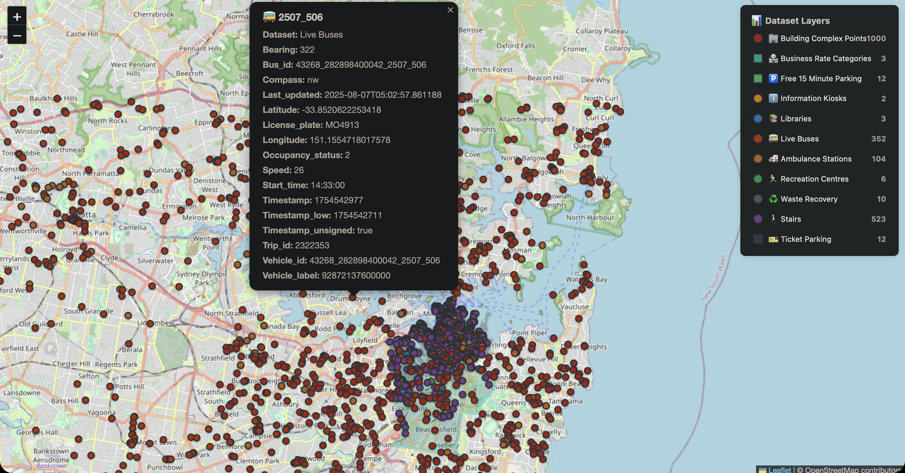

# Sydney spatial ETL and search

Docker application that indexes user-supplied Sydney GeoJSON datasets into Elasticsearch and serves an interactive map. A separate address API submits PostgreSQL searches through Redis to a Celery worker.



## Run the map

Requires Docker with Compose v2, Python 3, Bash and curl. The repository contains screenshots but does not distribute the original city data files. From the repository root:

```bash
./start-map.sh --demo           # create 11 labelled synthetic records and start the map
./start-map.sh --open           # use existing inputs and additionally open the browser
```

Open http://localhost:5002. Startup fails when required input files are missing or indexing fails. Inspect `docker compose logs data_indexer web_map`. Configure `STARTUP_TIMEOUT` (default 180 seconds) and `INDEX_TIMEOUT` (300 seconds) for slower machines. The map `/health` returns HTTP 503 when Elasticsearch is unavailable.

```bash
docker compose ps
docker compose logs -f gnaf_worker
docker compose down            # retain data volumes
```

## Address search

Address services are opt-in: `COMPOSE_PROFILES=address ./start-map.sh`. Live bus indexing is separately opt-in with `COMPOSE_PROFILES=live`. The GNAF loader image and its database are an external prerequisite. Set `GNAF_SCHEMA` to the populated schema containing `address_principals`; the default is `gnaf_202502`. Database readiness does not imply GNAF data has been loaded. Set `POSTGRES_PASSWORD` consistently using an untracked `.env` file. PostgreSQL, Redis and Elasticsearch are bound to loopback on the host; this demo has no public-service authentication.

```bash
curl 'http://localhost:5001/search?address=95%20Balo%20Street&state=NSW'
curl 'http://localhost:5001/search?address=95%20Balo%20Street&state=NSW&async=true'
# Poll the returned results_url on port 5001.
```

Synchronous search returns a JSON array, 400 for invalid input, 504 for timeout, or 503 for unavailable dependencies. Async search returns 202 and a task identifier; `/results/<task_id>` returns 200 when complete, 503 on failure, or 202 while pending/unknown. Results expire after one hour. Searches return at most 100 rows. Multiword street names and optional street numbers are supported; this is substring search, not a postal address parser.

## Real data inputs

Place the eleven filenames listed in `make_demo_data.py` under `data/`, using the original source GeoJSON exports and the indicated wrapper structure. The demo generator refuses to overwrite existing files. Synthetic data is for exercising the application, not evidence of infrastructure coverage or ETL throughput. Original city data acquisition, licensing and freshness must be documented for a real-data deployment.

## Verify

```bash
python -m venv .venv
. .venv/bin/activate
pip install -r requirements-dev.txt
python -m unittest discover -s tests -p 'test_*.py' -v
docker compose config --quiet
docker compose -f compose.test.yml up --build --abort-on-container-exit --exit-code-from integration
docker compose -f compose.test.yml down -v
```

The map integration runs `make_demo_data.py` then `docker compose -f compose.map-test.yml run --build --rm integration` and verifies every visible dataset search. Clean up with `docker compose -f compose.map-test.yml down -v`.

The address integration stack uses a two-row synthetic PostgreSQL fixture and a real Redis broker plus a separate Celery worker. It proves task execution without downloading the full GNAF database. CI runs both API failure tests and this integration. It does not claim full GNAF import validation, live bus availability, production load capacity, or current dataset freshness.

## Architecture

- `es_index_multi_docker.py`: validates required supplied inputs, transforms geometry and bulk indexes; failures exit nonzero.
- `web_map/app.py`: map, bounded searches, GeoJSON response and dependency health.
- `GNAF_search_api.py`: validated address requests, bounded synchronous wait and asynchronous polling.
- `docker-compose.yml`: map, Elasticsearch, address API, worker, Redis, GNAF database and optional live bus indexing.
- `compose.test.yml`: reproducible address integration fixture.

Source data and upstream GNAF loader retain their respective licensing and attribution requirements. Before a hosted deployment, add authentication, TLS, rate limits, secret management, backups, monitoring and capacity tests.

Elasticsearch is pinned to [7.17.29](https://www.elastic.co/blog/elastic-stack-7-17-29-released), retaining the 7.x client/index API while updating the bundled runtime used by the container.
